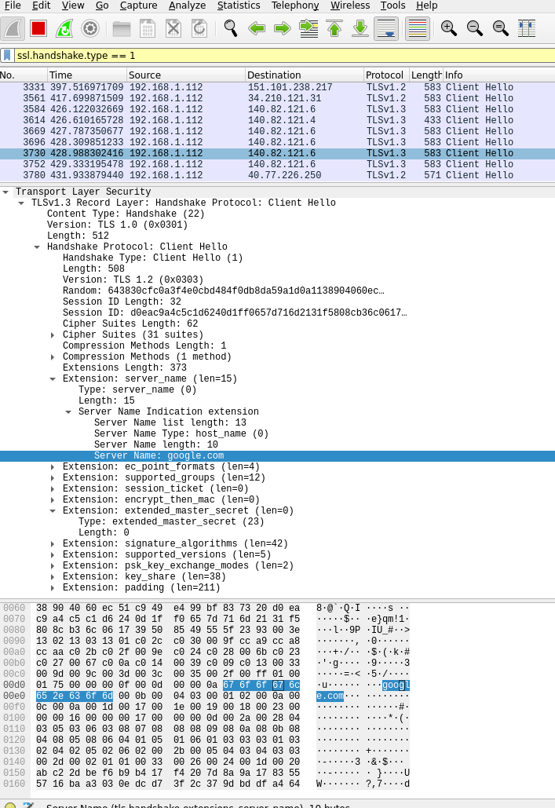
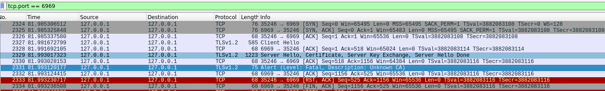

# Network programming Exercise 2 - Sigmund Granaas

The programs are written entirely in Rust, to compile them, you need Rustc, or Crates. A simple way to install rust is using rustup: <https://rustup.rs/>

## Binaries

To run the configured binaries, you can compile the source files, or run them with cargo, as specified in cargo.toml.

```toml
[lib]
name = "lib"
path = "src/lib/udp_server/lib.rs"

[[bin]]
name = "udp-calculation-server"
path = "src/bin/udp-calculator-server.rs"

[[bin]]
name = "udp-client"
path = "src/bin/udp-client.rs"
```

To run the bin with cargo type either of the following commands from the same directory as Cargo.toml.

```bash
cargo run --bin udp-client
cargo run --bin udp-calculation-server

```

The udp client and the udp calculation server communicates with each other. First start the server, then the client. Currently the adresses and ports are configured as a static string in `src/lib/udp_server/lib.rs` defaulting to `127.0.0.1:6969` and `127.0.0.1:7979`. The client and server will connect to either one of them and send messages to the other.

## Multithreading

No multithreading is really needed here, as the requests are handled without keeping a connection alive. This does not block anything, and removed the need for a multithreaded solution.

## Stability and error handling

Rust offers exhaustive handling of errors, though Enums such as `Result<Ok, Err>`, in some cases I have dealt with errors that might occur, but for the most part I hace handled the possibility of an error by calling `.unwrap()` this wil crash the program if something goes wrong. Some Errors should crash the service, as there is no point to continue if you can't for example bind to the socket. Mostly the program should handle errors from user input, but errors with the connection will likely crash the thread handling the connection to the server as there is no "failover".

## Providing valid Calculator input

The calculator has been made to transfer JSON calculation object which can handle simple calulations with the + and operators. floats are not supported. If the server is provided with Invalid JSON syntax it will try to compute what is present, but is might not be what should be expected. Proper syntax would be `10 + 10 - 1 + 3` or `11234 - 33336`. Remember a whitespace between numbers and operators. The handling of calculation errors could have been handled better, but building a robust calculator is not the scope of this exercise.

This is my first attempt at programming with Rust, the code is pretty garbage as I'm still trying to grasp fundamentals of the Rust programming language.

## Changes from the TCP calculator

There are no changes made to the calculator, as I already solved it by creating DTO's. The communication between server and client has been simplified a bit and almost everything is handled inside the main function. The implementation of using UDP in this case makes the entire program a lot easier to implement, as you can just fire off requests left and right without worrying about missed messages. If you need this totally awesome calculator to be reliable, you are in the wrong spot bud.

## SSL

For testing SSL functionality, I ditched the java example and rewrote the code in the first exercise to handle connections using SSL by implementing the example from the openSSL Module from the rust docs <https://docs.rs/openssl/0.9.19/openssl/ssl/index.html>. The code is not that much different and can be found under the SSL folder. I am successfully able to connect the client to google.com using TLS, if I change the server I am connecting to(google.com:443). I can verify that the connection is encrypted. The Tcp stream is succesfully wrapped in the SSLConnection struct. And the normal TcpStream is encrypted. I have filtered wireshark to only list filter SSL handshake stage 1, which is when the client sends the hello signal. This is captured from the client written in rust.



The filter I am using to only check for TLS handshakes is `ssl.handshake.type == 1` Here I can see the inital hello stage where the client is requesting information from the server. The source of the request `192.168.1.112` is my ip adress on the local network, and `140.82.121.6` is google's ip-adress. As I am using Ipv4, this makes sense. The bottom part of the image shows the encrypted data, which, suprise suprise, is unreadable, except for the part which says google.com

### Failing the SSL connection

The rust implementation of SSL communication didn't work out of the box. I wrapped all Tcp_clients in a SSL struct, which will ensure a valid handshake before the stream can actually transmit any useful data. To be able to succesfully transmit data between the client and the server, we need a public and a private key to sign a X.509 certificate. This is vital to be able to establish a succesfull encrypted connection. In this case I am trying to connect to myself, which should be safe, but these certificates rely on a third party to verify that this certificate is valid.

In this case, the keys needed by the server were produced by OpenSSL with this command: `openssl req -x509 -out localhost.crt -keyout localhost.key \ -newkey rsa:2048 -nodes -sha256 \ -subj '/CN=localhost' -extensions EXT -config <( \ printf "[dn]\nCN=localhost\n[req]\ndistinguished_name = dn\n[EXT]\nsubjectAltName=DNS:localhost\nkeyUsage=digitalSignature\nextendedKeyUsage=serverAuth")` This creates a public certificate and a private key, which the server needs.

When connecting securely to the server I am running into an issue. When using a sniffer, we can see the error that happens in the handshake.



Here I am filtering for tcp connections on port 6969, which is both the server and client talking to each other with the adress `127.0.0.1` which is the same as localhost. Here I am running into the error `Description: Unknown CA (48)`. This is telling me that this is an unknown CA(certificate authority), which is the third party which validates the certificate. This can be an issue when running apps locally, because there is no third party to validate the certificates. This error invalidates the entire transaction and the communication is ended. I tried to get around this issue by adding the certfificate as a trusted root in the system: The next step would be to set myself up as a local CA, and create valid certificates which I can trust on my local network, but it is beyond the scope of this exercise.
